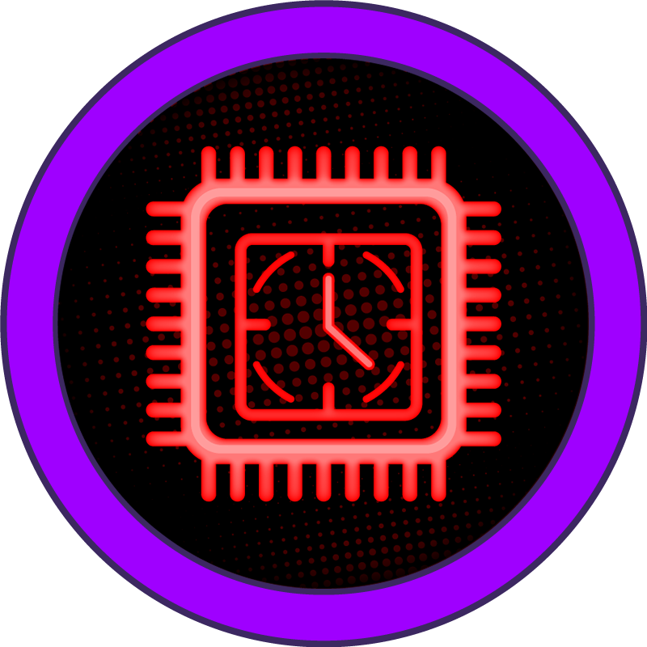
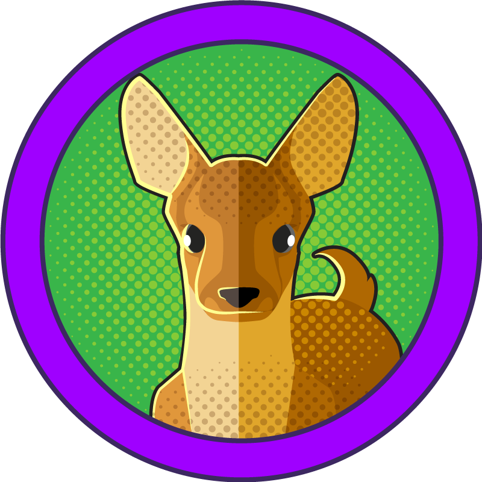
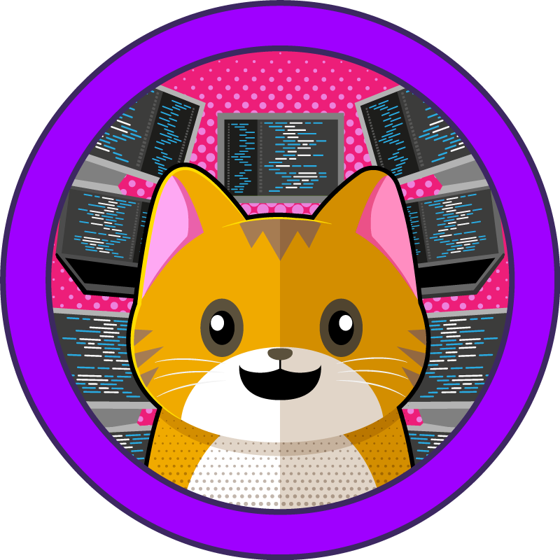

# HackTheBox Machines

This section contains all the HackTheBox machines I have completed. Each entry includes the name, logo, difficulty, date completed, and a link to the detailed walkthrough.

| Name               | Difficulty    | Date Completed | Walkthrough                     |
|--------------------|---------------|----------------|---------------------------------|
| 
**Responder** 
   | 🟣 Very Easy  | 
16-02-2025
     | [View Walkthrough](./Responder/README.md) |
| 
**Crocodile** 
   | 🟣 Very Easy  | 
16-02-2025
     | [View Walkthrough](./Crocodile/README.md) |
| 
**Sequel** 
   | 🟣 Very Easy  | 
12-02-2025
     | [View Walkthrough](./Sequel/README.md) |
| 
**Appointment** 
   | 🟣 Very Easy  | 
12-02-2025
     | [View Walkthrough](./Appointment/README.md) |
| 
**Redeemer** 
   | 🟣 Very Easy  | 
08-02-2025
     | [View Walkthrough](./Redeemer/README.md) |
| 
**Dancing** 
       | 🟣 Very Easy  | 
07-02-2025
     | [View Walkthrough](./Dancing/README.md) |
| 
**Fawn** 
                   | 🟣 Very Easy  | 
07-02-2025
     | [View Walkthrough](./Fawn/README.md) |
| 
**Meow** 
                   | 🟣 Very Easy  | 
07-02-2025
     | [View Walkthrough](./Meow/README.md) |

## Difficulty Icons
- 🟣 Very Easy
- 🟢 Easy
- 🟠 Medium
- 🔴 Hard

## Structure
Each machine has its own folder. Depending on the complexity of the machine, the folder may include:
- **`logo.png`**: A logo or screenshot representing the machine.
- **Walkthrough**: A detailed guide in `README.md`.
- **Screenshots**: Images related to the process, stored in a `screenshots/` folder.
- **Notes or scripts**: Additional files used during the exploitation process.

Feel free to explore the walkthroughs to follow my progress!
